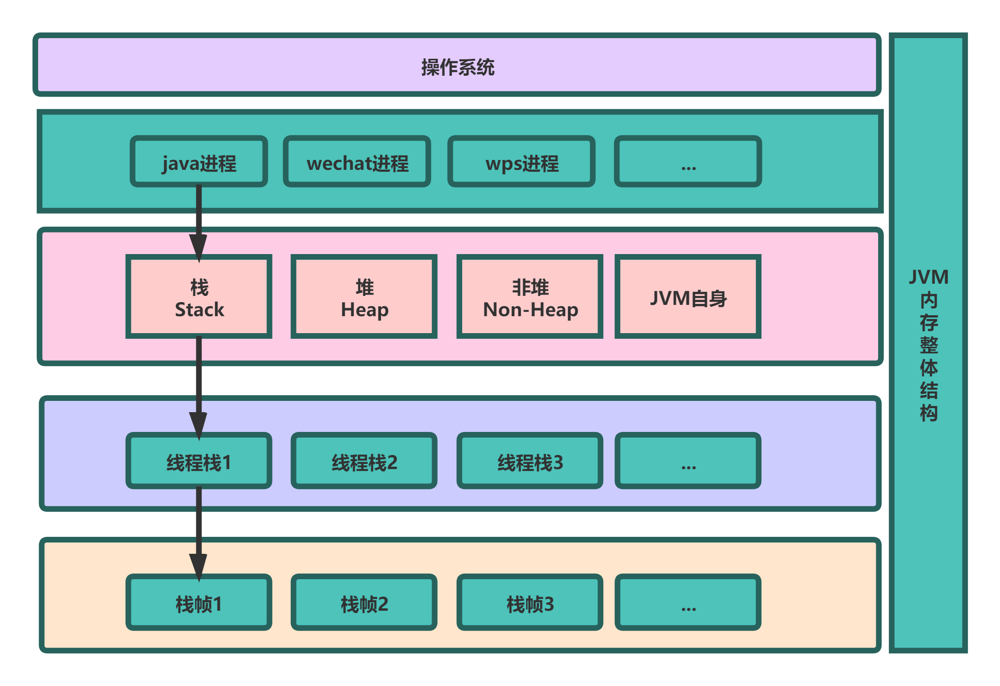

# 课程小结

## JVM

1. Java 内存区域与内存溢出异常

1.1 运行时数据区域

内存空间小，线程私有。字节码解释器工作是就是通过改变这个计数器的值来选取下一条需要执行指令的字节码指令，分支、循环、跳转、异常处理、线程恢复等基础功能都需要依赖计数器完成

如果线程正在执行一个 Java 方法，这个计数器记录的是正在执行的虚拟机字节码指令的地址；如果正在执行的是 Native 方法，这个计数器的值则为 (Undefined)。此内存区域是唯一一个在 Java 虚拟机规范中没有规定任何 OutOfMemoryError 情况的区域。

1.2 Java 虚拟机栈

线程私有，生命周期和线程一致。描述的是 Java 方法执行的内存模型：每个方法在执行时都会床创建一个栈帧(Stack Frame)用于存储局部变量表、操作数栈、动态链接、方法出口等信息。每一个方法从调用直至执行结束，就对应着一个栈帧从虚拟机栈中入栈到出栈的过程。

局部变量表：存放了编译期可知的各种基本类型(boolean、byte、char、short、int、float、long、double)、对象引用(reference 类型)和 returnAddress 类型(指向了一条字节码指令的地址)

StackOverflowError：线程请求的栈深度大于虚拟机所允许的深度。
OutOfMemoryError：如果虚拟机栈可以动态扩展，而扩展时无法申请到足够的内存。

1.3 本地方法栈

区别于 Java 虚拟机栈的是，Java 虚拟机栈为虚拟机执行 Java 方法(也就是字节码)服务，而本地方法栈则为虚拟机使用到的 Native 方法服务。也会有 StackOverflowError 和 OutOfMemoryError 异常。

1.4 Java 堆

对于绝大多数应用来说，这块区域是 JVM 所管理的内存中最大的一块。线程共享，主要是存放对象实例和数组。内部会划分出多个线程私有的分配缓冲区(Thread Local Allocation Buffer, TLAB)。可以位于物理上不连续的空间，但是逻辑上要连续。

OutOfMemoryError：如果堆中没有内存完成实例分配，并且堆也无法再扩展时，抛出该异常。

2. 内存模型之主内存和工作内存之间的交互

| 操作  |  作用对象 | 解释 |   
|---|---|---|
| lock  |  主内存 |  把一个变量标识为一条线程独占的状态 | 
| unlock  |  主内存 |  把一个处于锁定状态的变量释放出来，释放后才可被其他线程锁定
| 
| read  | 主内存	|  把一个变量的值从主内存传输到线程工作内存中，以便 load 操作使用
|  
|  load | 工作内存 |  把 read 操作从主内存中得到的变量值放入工作内存中
|  
| use  | 工作内存  |  把工作内存中一个变量的值传递给执行引擎，每当虚拟机遇到一个需要使用到变量值的字节码指令时将会执行这个操作 | 
|  assign | 工作内存 | 把一个从执行引擎接收到的值赋接收到的值赋给工作内存的变量，每当虚拟机遇到一个给变量赋值的字节码指令时执行这个操作  |
|  store |  工作内存 |  把工作内存中的一个变量的值传送到主内存中，以便 write 操作
| 
|  write |  工作内存 |  把 store 操作从工作内存中得到的变量的值放入主内存的变量中
|

2.2 结构/流程图

1）JVM内存模型


2）JVM组成



3）Java虚拟机类加载器双亲委托加载流程图


## NIO

1. 服务端客户端交互过程

    客户端请求服务端，经过TCP三次握手，连接建立成功；
    内核等待网卡数据到位；
    内核将缓冲区数据拷贝到用户空间缓冲区；

2. 对于IO的这一块内容，理解起来相对困难，以下是自己对于IO多路复用的推演的理解，关于Netty的知识点总结如下。
Java NIO
* Java NIO全称是java non-blocking IO，是指JDK提供的新API。从JDK1.4开始，Java提供了一系列改进的输入输出的新特性，被通称为NIO，是同步非阻塞的IO模型。
* NIO相关类放在java.nio包以及子包下。
* NIO有三大核心部分：Channel（通道），Selector（选择器），Buffer（缓冲区）。
* NIO是面向缓冲区，或者面向块编程的。数据读取到一个稍后处理的缓冲区，需要的时候可以在缓冲区前后移动，这就增加了处理过程的灵活性，使用它可以提供非阻塞的高伸缩网络。
* Java NIO的非阻塞模式，是一个线程从某个通道发送请求或者读取数据，但是它仅仅能得到目前可用的数据，如果当前没有任务可做，他也不会阻塞等待，它可以去完成其他的事情。
* NIO可以做到一个线程来处理多个操作，假设有10000个请求过来，根据实际情况，可以分配50到100个线程来处理，而不是必须要创建10000个线程。
HTTP2.0使用了多路复用技术，做到同一个连接并发处理多个请求，而且并发请求的数量比HTTP1.1打了好几个数量级。


3. socket通信模型


## 并发编程

1. 线程（多线程的来由、线程定义、java线程和os线程的关系）

```
new、runnable（ready+running）、 waiting 、timed_waiting、 blocked、 Terminated

Thread:start()和run()区别、join（插队）、sleep（抱着锁睡觉）、wait&notify(Object的方法、扔掉锁等待)、volatile（线程可见性+内存屏障防止指令重排，单例的演化，不保证原子性）、synchronized（1.5前后对比、锁升级、无锁+偏向锁+轻量级锁+重量级锁、属于非公平锁、CAS自旋（乐观锁机制）、对象头WordMark（锁信息、hashcode、分代年龄、偏向锁的线程ID） ）
```

2. 线程池
  ```
  核心要素：核心线程+队列+非核心队列+拒绝策略+超时时间
  
  自带的线程池类型：newFixedThreadPool（队列无限制，OOM）、newSingleThreadExecutor（单线程，性能低）、newCachedThreadPool（非核心线程无限制，CPU打满）、自定义线程池
```
	
	
3. 并发编程

```
3.1 

锁：Lock（对比synchronized和Lock的区别）、ReentrantLock（默认为非公平锁，可以设置为公平锁）、Condition（模拟消费者生产者模式中的指定线程调度）、AQS（state+CAS自旋锁+队列）


3.2 

原子操作类：AutomicLong（CAS）、LongAdder（分段锁机制，高并发下提高性能，那就是说如果现在有５个线程竞争A，如果是原子类的话，就会出现１个成功了，４个在自旋，而使用Long Addｅｒ的话，就会让５个并发操作，其实就是分段的概念，类似用空间换时间）

3.3 线程调度：CountDownLatch、CycleicBarrier、Semaphore

3.4 ConCurrentHashMap（1.7 分段锁机制、桶、扩容）
```

4. 生产者消费者

5. 主线程等待子线程结束的方式(sleep、CountDownLatch、CycleicBarrier、Semaphore、join)

6. 全局计数

7. 总结图

7.1 线程池示意图


7.2 线程池任务提交流程图


## Spring 和 ORM 等框架

1、Spring优势：
			
	是一个开源免费的框架，支持轻量级无侵入式的企业级应用开发，其中IOC控制反转和AOP面向切面编程是其特点。
⽅便解耦，简化开发 

	通过Spring提供的IoC容器，可以将对象间的依赖关系交由Spring进⾏控制，避免硬编码所造成的过度程序耦合。⽤户也不必再为单例模式类、属性⽂件解析等这些很底层的需求编写代码，可以更专注于上层的应⽤。 

AOP编程的⽀持
		
	通过Spring的AOP功能，⽅便进⾏⾯向切⾯的编程，许多不容易⽤传统OOP实现的功能可以通过AOP轻松应付。

声明式事务的⽀持

	@Transactional
		可以将我们从单调烦闷的事务管理代码中解脱出来，通过声明式⽅式灵活的进⾏事务的管理，提⾼开发效率和质量。

⽅便程序的测试

	可以⽤⾮容器依赖的编程⽅式进⾏⼏乎所有的测试⼯作，测试不再是昂贵的操作，⽽是随⼿可做的事情。
	
⽅便集成各种优秀框架
		
	Spring可以降低各种框架的使⽤难度，提供了对各种优秀框架（Struts、Hibernate、Hessian、Quartz等）的直接⽀持。
	
降低JavaEE API的使⽤难度

	Spring对JavaEE API（如JDBC、JavaMail、远程调⽤等）进⾏了薄薄的封装层，使这些API的使⽤难度⼤为降低。
	
源码是经典的 Java 学习范例
		
	Spring的源代码设计精妙、结构清晰、匠⼼独⽤，处处体现着⼤师对Java设计模式灵活运⽤以及对Java技术的⾼深造诣。它的源代码⽆意是Java技术的最佳实践的范例。


2、Spring的IOC容器

Spring IOC 容器是整个Spring框架的核心部分。容器会创建对象，配置对象之间的依赖关系，并且还会管理这些对象完整的生命周期。Spring IOC容器使用 依赖注入（D） 来管理组成应用程序的组件。

Spring主要提供了两种IOC容器

a. BeanFactory容器

BeanFactory本质上是一个提供了可以维护注册在它里面的不同对象，以及维护这些对象之间的依赖关系的高级工厂接口。通过创建一个XML格式的来定义Bean，并且通过读取这个XML文件来获取定义的Bean。开发人员可以使用BeanFactory来管理和使用注册在里面的Bean对象。
```java
InputStream is = new FileInputStream("beans.xml");
BeanFactory factory = new XmlBeanFactory(is);

HelloWorld obj = (HelloWorld) factory.getBean("helloWorld");
```


也可以通过这种方式来实现：
```java
Resource resource = new FileSystemResource("beans.xml");
BeanFactory factory = new XmlBeanFactory(resource);

ClassPathResource resource = new ClassPathResource("beans.xml");
BeanFactory factory = new XmlBeanFactory(resource);
```


BeanFactory接口有很多种方法供客户端使用，这里简单的介绍几种：

* boolean containsBean(String):如果BeanFactory容器中包含给定名称的Bean或Bean实例，就返回true。 
* Object getBean(String):返回给定名称注册的Bean的实例，如果找不到该实例将会抛出 NoSuchBeanDefinitionException异常。 
* boolean isSingletion(String)返回给定名称的Bean是否是单例 
* String [] getAliases(String)返回给定Bean实例的别名。

b. ApplicationContext容器

ApplicationContext添加了一些额外的企业特定的功能，比如从配置文件中处理文字信息的能力，再比如事件发布监听的能力。这个容器被定义org.springframework.context.ApplicationContext 接口。

ApplicationContext容器提供了 BeanFactory容器的全部功能，所以它被推荐用来代替 BeanFactory。BeanFactory依然也可以使用在轻量级的应用上，比如像是手机设备或者java applet应用上。

几种ApplicationContext
	
* FileSystemXmlApplicationContext 
* ClassPathXmlApplicationContext 
* WebXmlApplicationContext


3、Spring 框架生态

Spring boot: 加速Web开发的依赖Spring框架的脚手架（约定大于配置，管理依赖）

Spring Cloud: 提供分布式开发各种分布式组件的集成

1）Bean的生命周期


4、ORM框架：

* spring-data-jpa:基于 hibernate 
* mybatis: 通过XML或者注解的方式将要执行的sql语句配置起来，并通过java对象和sql语句映射成最终执行的sql语句。

5、Collection框架：Map、Collection

## MySQL 数据库和 SQL

1. 执行引擎（Innodb+myisam）
2. 索引（B+Tree，B-Tree主键索引的推演+聚簇索引+非聚簇索引+回表+主键的实现策略（大小、顺序、页分裂）+hash索引、覆盖索引、联合索引、最左匹配原则、前缀索引、倒排索引）
3. 锁：行锁、表锁、间隙锁、临键锁、乐观锁、悲观锁、死锁
4. 优化（索引优化、MySQL优化）
5. 事务：

ACID：原子性、一致性、隔离性、持久性

隔离级别：未提交读（脏读、幻读、重复读）、已提交读（重复读、幻读）、不可重复读（幻读，但是在mysql中通过临键锁解决了，不存在幻读）、串行读

MVCC：MVCC解决的是不同的事务之间读写版本冲突的问题；MVCC没办法解决不同事务之间写写冲突的问题，如果要解决可以通过两种方式，应用层面做到并发控制，串行写，不让数据库层面出现并发写；还有一种就是在数据库层面显示加锁；

6. 日志文件：undolog（事务的原子性保证、MVCC的实现关键点之一）、 redolog（保证了mysql数据的持久性，采用了内部的XA两阶段提交）、 binlog（主从复制）
7. 读写分离：主从复制（异步复制、半同步复制）

1）结构示意


2）主键索引行存储


## 分库分表
1. 简介

- 单体架构应用:
项目初期，用户量不大时，往往是使用单体应用架构，所有应用代码都打成一个包发布、所有数据都存储在一个数据库中。

随着业务的发展，数据量、访问量增加，经过单体架构的sql优化、索引优化、缓存优化、数据库参数优化等优化手段都用完了，还是没能达到理想的效果时，就需要对数据库进行拆分。

2. 分库

分库就是把原本All in one的数据库按照一定的维度进行数据库的拆分，比如一个电商系统，原本是用户相关表、订单相关表、库存相关表、优惠相关表都是在同一个数据库中，现在要按照这些维度进行拆分。
- 拆分前：


- 拆分后：


这样拆分称为分库，是为了减少单库的压力。

3. 分表

当数据量达到一定规模后，分库往往也无法达到预期的性能要求，此时就需要对数据进行分表。
分表通常有两种类型：垂直分表和水平分表

- 垂直分表

垂直切分是基于表字段安装一定业务逻辑进行划分的，拆分成不同的表，表结构往往是不一样的。 比如对一个商户信息表拆分成若干个表，然后用一个商户编号进行关联，这种就是表的垂直拆分，避免一个数据表太多字段。


- 水平分表

当数据量是在太大 达到单表2000万，此时无论怎么垂直拆，都不好解决性能问题，就需要水平分表。
水平分表就是按照一定的规则，比如日期、对id进行取模、对id进行分段、对某个规则字段进行分段、地区等等规则，对同一个表的数据进行拆分，这些表的表结构一模一样，只是数据不一样，对数据进行了分片，跟redis的集群分片相似。这些拆分的表可以分配在同一个库，也可以在不同库。比如原本2000万数据，进行分成10个表，就是每个表200w，大大减少了数据库的单表压力。

4. 分库分表带来的问题：

- 跨库关联查询，比如如果要查询合同信息的时候，要关联用户信息，但是由于进行了分库分表，所以不能直接像单库那样join连接查询，这里有几种解决方案（主要是概述，具体操作要看其他文章）：
- 字段冗余，比如查询合同信息表要关联查询用户信息表的用户名、电话号码，就把这两个字段冗余到合同信息表中，然后直接单表查询就能查询到相应信息，不用跨库关联查询了。
- 数据同步：比如商户系统要查询产品系统的产品表，我们干脆在商户系统数据库中创建一张产品表，通过ETL或者其他方式定时同步数据。
- 全局表：比如一些表再大多数系统中都用到，并且该表的数据的变化频率比较小，比如字典表，就可以在所有系统数据库中冗余这些表数据，这些表叫作全局表，然后修改时就做一些同步操作。
- ER表（绑定表）：我们有些表是存在主外键关系的，比如订单表和订单明细表，有从属关系，在我们水平分表时，如果父表的数据与子表对应的数据被分配在不同的库，就会产生跨库关联的不必要麻烦，如果把对应数据存储在同一个库，就避免这个麻烦，比如订单表跟订单明细表是一对多的关系，我们就可以把订单id为1的订单表记录和订单明细表中，订单id为1的记录落库在同一个库中，此称为绑定表。

5. 总结图示


## RPC和微服务

1、RPC基本原理：

+ RPC ：Remote Procedure Call 远程过程调用
   - 核心机制：
     - 网络传输通信方式和协议、序列化方式、调用的方法标识 
     - RPC框架：Dubbo、Thrift、gRPC、Hessian
     

   - Client端通过本地的代理存根ClientStub生成代理类ProxyService

   - ProxyService实例访问调用请求 
     - ClientStub接收到调用请求后将Class全限定类名、方法名、参数等组装为指定序列化方式的网络传输消息体
     - ClientStub调用远程服务地址，将消息通过某种传输协议发送到服务端；

   - ServerSkeleton处理远程调用 
     - 通过远程方式获取到请求后，通过协商的序列化方式进行反序列化
     - 通过解码后的请求体通过反射、差找Bean单例池（Spring框架）等方式找到本地的服务并执行； 
     - 将返回结果序列化返回给调用方；

   - ClientStub接收到信息后，将结果反序列化，返回给调用端;

3、RPC框架实现：
	
    1）定义共享接口和类
	2）使用动态代理实现远程访问：JDK的InvocationHandler、CGLib、Spring的AOP
	3）选择序列化方式：文本、JSON、二进制流等
	4）传输协议：TCP、HTTP，通过Netty、RestTemplate、HTTPClient等方式远程调用
	5) 使用反射或者差找Bean单例池等方式在服务端查找到Class

4、微服务
* 概念
  微服务架构风格，就像是把一个单独的应用程序开发为一套小服务，每个小服务运行在自己的进程中，并使用轻量级机制通信，通常是HTTP API。这些服务围绕业务能力构建，并通过完全自动化部署机制来独立部署，这些服务，使用不同的编程语言书写，以及不不同的存储技术，并保持最低限度集中式管理。微服务的目的是有效的拆分应用，实现敏捷开发和部署。

* 框架：Spring Cloud 

* 服务治理：注册中心+路由+熔断限流+配置中心


## 分布式缓存

1. 分布式缓存是独立部署的服务进程，并且和应用程序没有部署在同一台服务器上。所以是需要通过远程网络请求来完成分布式缓存的读写操作，并且分布式缓存主要应用在应用程序集群部署的环境下。

2. 

### 分布式缓存优点：

+ 支持大数据量存储
  + 分布式缓存是独立部署的进程，拥有自身独自的内存空间，不需要占用应用程序进程的内存空间，并且还支持横向扩展的集群方式部署，所以可以进行大数据量存储。
+ 数据不会随着应用程序重启而丢失 
  + 分布式缓存和本地缓存不同，拥有自身独立的内存空间，不会受到应用程序进程重启的影响，在应用程序重启时，分布式缓存的存储数据仍然存在。
+ 数据集中存储，保证数据的一致性 
  + 当应用程序采用集群方式部署时，集群的每个部署节点都有一个统一的分布式缓存进行数据的读写操作，所以不会存在像本地缓存中数据更新问题，保证了不同服务器节点的 数据一致性。 
+ 数据读写分离，高性能，高可用 
  + 分布式缓存一般支持数据副本机制，实现读写分离，可以解决高并发场景中的数据读写性能问题。而且在多个缓存节点冗余存储数据，提高了缓存数据的可用性，避免某个缓存节点宕机导致数据不可用问题。
  
### 分布式缓存缺点：
+ 数据跨网络传输，读写性能不如本地缓存 
+ 分布式缓存是一个独立的服务进程，并且和应用程序进程不在同一台机器上，所以数据的读写要通过远程网络请求，这样相对于本地缓存的数据读写，性能要低一些。


### 懒加载：
+ 同步加载：业务服务读时加载并返回 
+ 异步加载：
  + 读先返回空，异步线程加载缓存，适用于重要性不高的数据
  + 定时更新缓存，无需业务干涉
  

3. 中间件产品
+ redis：Redis 是开源免费的高性能key-value分布式内存数据库，是基于内存且支持持久化的NOSQL数据库

+ redis特别快的原因：
  + 内存操作
  + 指令执行为单线程，无需将时间小号在线程创建、调度等事情上3
  + 采用了非阻塞的IO多路复用机制（事件驱动）

+ redis的基础数据：string、hash、list（链表）、set（去重）、sortedSet

+ 一致性hash：针对集群的扩缩容需要保证一致性hash。日常开发过程中，使用到缓存的地方有CDN、反向代理、Redis+Spring boot，针对Redis数据的一些高级功能。


## 分布式消息队列

+ 系统间通信方式：目前主流的为 数据库+文件+Socket+RPC+消息

+ 消息中间件通用模型：procuder+MQ(exchange->queue)+consumer 

+ 消息队列通信的特性： 解耦+异步+削峰填谷+内置各种场景的高效通信机制（以rabbitmq为例：点对点+workQueue+发布订阅+路由+主题）+延时队列（TTL+DeadQueue）

+ 消息的可靠性保证：确认机制、分布式事务、服务质量（最多发一次+最少发一次+有且仅有一次）、服务幂等、消息重试、死信队列

+ 业界主流的消息中间件：RabbitMQ、ActiveMQ、Kafka、RocketMQ

+ 与Spring-boot的整合

+ 业务场景：电商系统微服务解耦、日志收集、秒杀系统削峰限流、订单过期优惠券过期等延时处理、汇率同步订单状态同步等有规律的定时同步。日常业务开发中，用到RabbitMq较多，但是在日常工作中针对消息的可靠性这一块没有做多过的考虑，是后续可以改进的地方。


> **_^_^_**
非常感谢秦老师，助教和宇㬢班班！
>


